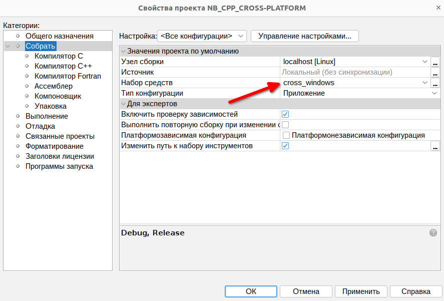
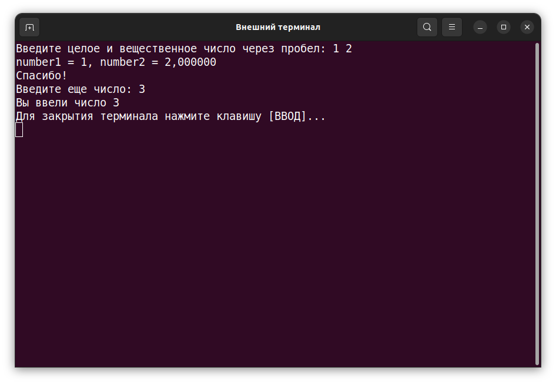

# NB_CPP_CROSS-PLATFORM
Пример программы на C++ в NetBeans с использованием кроссплатформенной компиляции 
(разработка в Linux для запуска Windows)

** sudo apt install mingw-w64 **


```
/usr/bin
x86_64-w64-mingw32-gcc
x86_64-w64-mingw32-g++
x86_64-w64-mingw32-ar
/usr/bin/gmake
/usr/bin/gdb
/usr/bin/qmake
/usr/bin/cmake
```





```
#include <stdio.h>
#include <iostream>
#include <clocale>

using namespace std;

int main(int argc, char** argv) {
    int number1;
    float number2;

    setlocale(LC_ALL, "");

    /* Стиль С из  <stdio.h> */
    printf("Введите целое и вещественное число через пробел: ");
    scanf("%d %f", &number1, &number2);
    printf("number1 = %d, number2 = %f \n", number1, number2);
    puts("Спасибо!");

    /* Стиль С++ из  <iostream> */
    cout << "Введите еще число: ";
    cin >> number2;
    cout << "Вы ввели число " << number2 << endl;

    return 0;
}

```




https://wiki.codeblocks.org/index.php/Code::Blocks_and_Cross_Compilers

https://localcoder.org/how-to-compile-for-windows-on-linux-with-gcc-g
